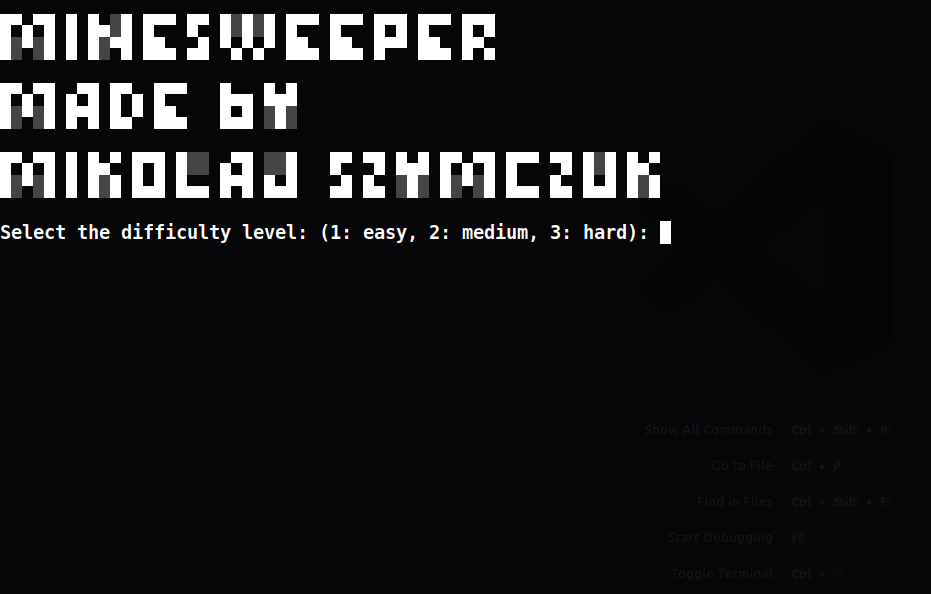

# Minesweeper (TypeScript)

## Overview:
Minesweeper console game written in TypeScript :grinning:<br>
Made by: Mikołaj Szymczuk

---
## TechStack:

- TypeScript
- Jest
- Gulp.js
- Node.js

---
## Setup project Guide:

### 1. Clone repo

### 2. Install packages
```
npm install
```
### 3. For development (run gulp watcher)
```
npm run dev
```
### 4. Build
```
npm run build
```
### 5. Run tests
```
npm run test
```
### 6. Start game
```
node dist/app.js
```
---
## Controls in the game
After run the game, enter difficult number:


In each turn you have 3 options:<br>
1. put up or take the flag
2. discover field
3. exit game


## Have Fun !!!
